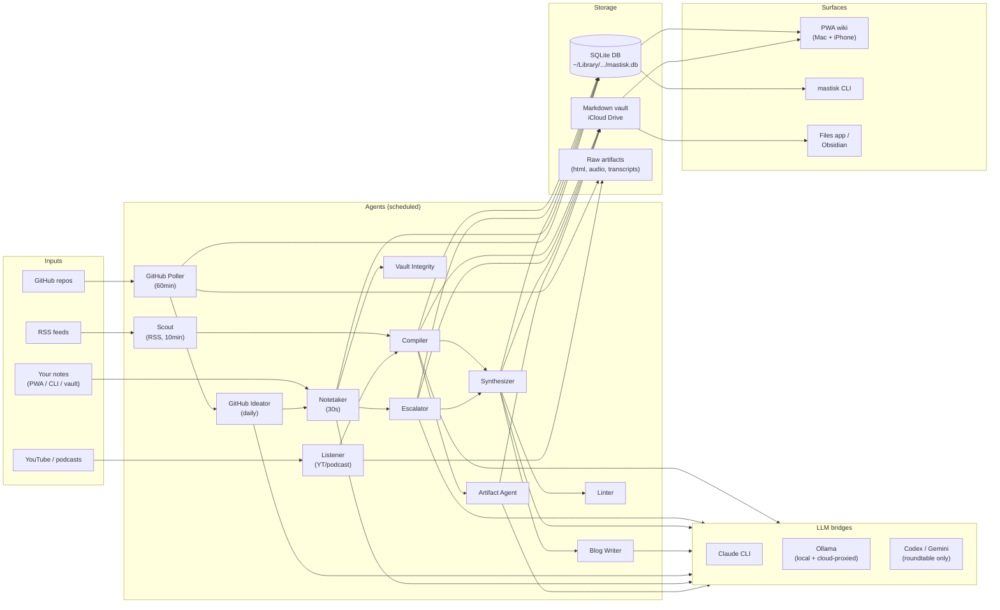
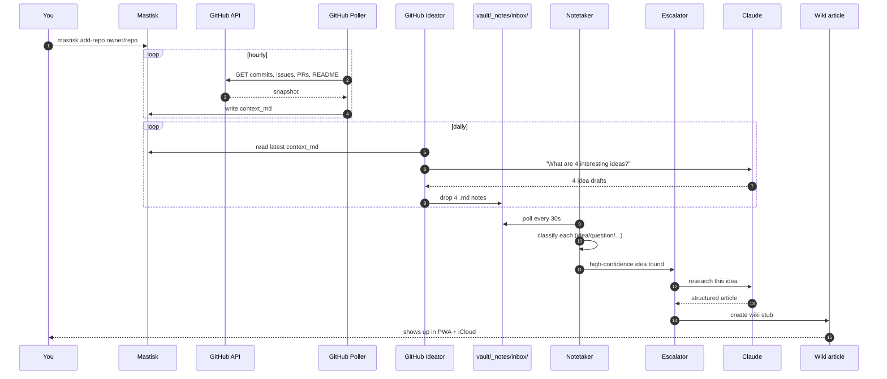

# Mastisk

> A personal knowledge wiki with 24/7 research agents.
> Runs locally on your Mac. Uses your Claude Code subscription + Ollama. Syncs the vault via iCloud. Installs as a PWA on your phone via Tailscale.

Mastisk is the assistant that **reads, watches, listens, and thinks for you in the background** — then hands you a wiki you actually wrote together. RSS, YouTube, podcasts, your notes, and the GitHub repos you care about all flow through a small fleet of agents that turn raw input into linked, cited, opinionated articles.

---

## Table of contents

- [What you get](#what-you-get)
- [How it works (architecture)](#how-it-works-architecture)
- [The agents](#the-agents)
- [How an idea is born (end-to-end flow)](#how-an-idea-is-born-end-to-end-flow)
- [Install (one command)](#install-one-command)
- [Prerequisites](#prerequisites)
- [Configuration](#configuration)
- [Running it](#running-it)
- [Phone setup](#phone-setup)
- [Connecting your GitHub](#connecting-your-github)
- [Connecting Google Calendar](#connecting-google-calendar)
- [Capturing notes](#capturing-notes)
- [Multi-LLM roundtable](#multi-llm-roundtable)
- [Shape what the agents produce](#shape-what-the-agents-produce)
- [CLI reference](#cli-reference)
- [What lives where](#what-lives-where)
- [Uninstall](#uninstall)

---

## What you get

| capability | what it does |
|---|---|
| **RSS reading agent** | Polls feeds you subscribe to. Filters by your interests + dislikes. Compiles relevant items into wiki articles. |
| **YouTube + podcast listener** | Pulls audio, transcribes locally with `mlx-whisper`, compiles a summary article. |
| **Notes** | Capture from PWA, CLI, or any editor. Auto-classified (`idea`, `question`, `task`, `quote`…). |
| **Auto-escalation** | High-value notes (ideas, questions) get researched by Claude into wiki-article stubs without you asking. |
| **GitHub repo tracking** | Hourly poll of commits, issues, PRs, README. Daily idea generation per repo. |
| **Multi-LLM roundtable** | Fan a prompt out to Claude / Codex / Gemini / Ollama in parallel. Get a synthesis paragraph that calls out where they agree and disagree. |
| **Knowledge graph** | Force-directed graph of your concepts and entities, with backlinks and a digest ranker. |
| **Synthesis pages** | Cross-article essays drafted by a Draft → Critic loop, refreshed as new sources land. |
| **Blog drafts** | "Personal blog post" first-person drafts assembled from your recent synthesis. |
| **Visual artifacts** | Diagrams + charts auto-generated for articles by a heavy local model. |
| **Markdown vault** | Everything is also plain markdown in iCloud Drive. Open it in Obsidian, vim, the Files app, anything. |
| **PWA on your phone** | Installable, offline-friendly, full-screen. Read on the bus. |

Everything is **local-first**: your wiki lives in your iCloud Drive, your DB lives in `~/Library`, your secrets never leave your Mac.

---

## How it works (architecture)

Mastisk is a single Python process running on your Mac. It exposes a FastAPI app on `127.0.0.1:5555` (and your Tailnet hostname) and runs a scheduler that ticks each agent on its own cadence. Inputs come in from the outside world; agents process them through Claude (via the `claude` CLI) and Ollama (local + cloud-proxied); outputs land in a SQLite DB **and** a markdown vault in iCloud.



**Key ideas:**

- **Agents are independent and small.** Each one is ~150–600 lines of Python with a single responsibility. They communicate through a `jobs` queue in SQLite.
- **Two LLM tiers, two budgets.** Cheap local Ollama for classification and embeddings; Claude for "actually think about this" work. Each agent has a daily cap so a runaway loop can't burn your Claude quota overnight.
- **The vault is the truth.** Articles, notes, synthesis pages, repo snapshots — all are markdown in iCloud. The DB is an *index*; you can wipe it and rebuild from the vault.
- **No API keys for Claude.** Mastisk shells out to the `claude` CLI, which uses your existing Claude Code session. You never paste an Anthropic key.

---

## The agents

| agent | trigger | what it does |
|---|---|---|
| **Scout** | every 10 min | Polls RSS feeds. Embeds each item against your `interests.md`. Drops irrelevant or `dislikes.md`-matching items. Enqueues a Compiler job for the rest. |
| **Listener** | on demand (`add-youtube` / `add-podcast`) | Downloads audio with `yt-dlp`, transcribes with `mlx-whisper`, hands the transcript to Compiler. |
| **Compiler** | per-job | Turns one source into a structured wiki article (title, summary, sections, related links, confidence) via Claude. Writes to DB + vault. |
| **Synthesizer** | periodic | Drafts cross-article Synthesis pages with a Draft → Critic loop. Refreshes when new related articles land. |
| **Notetaker** | every 30s | Watches `vault/_notes/inbox/`. When a new file is stable for 30s, classifies it locally (Ollama) into idea / question / task / quote / etc. |
| **Escalator** | per-classified-note | If a note is an idea or question with high confidence and enough length, kicks off Claude research. Output: a wiki-article stub linked from the note. |
| **GitHub Poller** | every 60 min | For each tracked repo: pulls commits, open issues, open PRs, and README via the GitHub API. Builds a `context_md` snapshot. |
| **GitHub Ideator** | daily per repo | Reads the latest `context_md` and generates ~4 idea-notes per repo per day. Each idea flows back through the Notetaker → Escalator pipeline. |
| **Blog Writer** | on demand | Drafts a personal blog post in your style from recent synthesis pages. |
| **Artifact Agent** | per article | Generates 1–3 visual artifacts (diagrams, charts) per article via a heavy local model. |
| **Linter** | hourly | Health checks: dead links, stale stubs, articles with too-low confidence, etc. |
| **Vault Integrity** | hourly | Tombstones notes whose vault file was deleted from outside Mastisk (e.g. you cleaned up in Obsidian). |
| **Roundtable** | on demand | Fans a prompt to Claude / Codex / Gemini / Ollama in parallel and synthesizes. |

---

## How an idea is born (end-to-end flow)

This is the GitHub-repo-driven path — it's the densest demonstration of how the pieces compose. Each numbered step is a real subsystem you can poke at.



In plain English:

1. You run `mastisk add-repo anthropics/claude-code`. The repo gets registered in the DB.
2. Once an hour, the **GitHub Poller** asks the GitHub API for that repo's commits, open issues, open PRs, and README. It assembles a markdown snapshot called `context_md`.
3. Once a day per repo, the **GitHub Ideator** reads the latest `context_md`, asks Claude *"given this repo's recent activity, what are four interesting ideas to explore?"*, and writes the four answers as note files into `vault/_notes/inbox/`.
4. The **Notetaker** is watching that inbox. Every 30 seconds it scans for new files; when one is stable, it sends the text to Ollama and gets back a classification (`idea` / `question` / `task` / `quote` / …).
5. If the note is classified as an `idea` or `question` *with high confidence and enough length*, the **Escalator** picks it up.
6. The Escalator hands it to Claude with a research prompt. Claude returns a structured article (title, summary, sections, citations).
7. That article lands in your wiki — both the SQLite DB **and** as markdown in your iCloud vault. It's now reachable in the PWA, in the Files app, and in Obsidian.
8. Later, the **Synthesizer** may pull this article into a cross-article Synthesis page if it sees enough related material. The **Linter** keeps an eye on dead links and low-confidence stubs.

The same pattern works for RSS (`Scout` instead of `GitHub Poller/Ideator`) and YouTube/podcasts (`Listener`). Notes you write yourself ride the same Notetaker → Escalator pipe.

---

## Install (one command)

```bash
git clone <this-repo> ~/Code/mastisk
cd ~/Code/mastisk
./install.sh --autostart
```

That's it. `install.sh` checks prereqs, builds the frontend, installs the Python package via `uv tool`, pulls an embed model, initializes config + iCloud vault, enables launch-at-login, and prints your phone URL.

Want the demo wiki (Test-time compute + friends) so you can see what a populated install looks like?

```bash
./install.sh --autostart --demo
```

Update to the latest code (git pull + rebuild + reinstall + restart):

```bash
mastisk update            # works from anywhere once installed
mastisk update --check    # show pending commits without applying
# or equivalently:
./install.sh --update     # same thing, script form
```

Uninstall (preserves your iCloud vault):

```bash
./install.sh --uninstall
```

---

## Prerequisites

| tool | install | required? | why |
|---|---|---|---|
| **uv** | `curl -LsSf https://astral.sh/uv/install.sh \| sh` | yes | isolated Python tool install |
| **node** | `brew install node` | yes | builds the frontend once |
| **claude** | [claude.com/claude-code](https://claude.com/claude-code) + `claude login` | yes | agents use your Claude subscription |
| **ollama** | `brew install ollama` | optional but recommended | local + cloud-proxied models, embeddings |
| **tailscale** | `brew install --cask tailscale` or App Store | optional | phone access from anywhere |
| **codex / gemini** CLIs | per-tool docs | optional | only needed if you want them in roundtables |

`install.sh` verifies these and tells you which are missing.

---

## Configuration

### Where things live

| what | where | format | required? |
|---|---|---|---|
| **Claude auth** | managed by `claude` CLI | — | required; run `claude login` |
| **Ollama Cloud API key** | `config.toml` → `ollama_cloud_key` | string | optional; skip to use local Ollama only |
| **GitHub PAT** | `config.toml` → `[github] pat` (or PWA → Settings → GitHub) | classic PAT, `public_repo` scope | optional but recommended |
| **Google Calendar OAuth** | `config.toml` → `[calendar] client_id/client_secret`, then `mastisk calendar-connect` | Google Cloud OAuth client type: Desktop app; scope: `https://www.googleapis.com/auth/calendar.readonly` | optional; for read-only Today events |
| **Tailscale auth** | Tailscale app (menu-bar icon) | — | optional; only if you want phone access |
| **RSS feeds** | SQLite `rss_feeds` table | URL list | needed for Scout to do anything |
| **iCloud sync** | macOS Settings → Apple ID → iCloud → iCloud Drive → on | — | required for phone-side vault access |

`config.toml` lives at `~/Library/Application Support/Mastisk/config.toml`. It's the only place secrets are stored on disk, and it's locked to mode `0600`.

### Setting the Ollama Cloud key

Three ways:

```bash
# 1. At install time (prompts interactively)
mastisk init

# 2. Non-interactively
mastisk init --ollama-key sk-xxx

# 3. Edit directly later (the file is human-readable)
open ~/Library/Application\ Support/Mastisk/config.toml
```

**Tip:** if you've already done `ollama signin` in the Ollama desktop app, your local Ollama transparently proxies `:cloud`-tagged models. In that case you don't strictly need to put the cloud API key into Mastisk's config.

### Setting the GitHub PAT

Three ways:

```bash
# 1. PWA → Settings → GitHub → paste PAT (validates against the API)
# 2. Edit ~/Library/Application Support/Mastisk/config.toml under [github]
# 3. export MASTISK_GITHUB_PAT=ghp_xxx   (env var override)
```

A classic PAT with `public_repo` scope gets you 5,000 GitHub API requests/hour. Without one you're limited to 60/hour, which the Poller will hit fast.

### Per-agent budgets and models

`config.toml` also holds:

- daily budget caps per agent (`[budget]`) — hard limits on how many jobs each agent runs per day
- model selection (`embed_model`, `summarize_model_heavy`, `summarize_model_cheap`)
- subsystem-specific config blocks: `[notes]`, `[roundtable]`, `[github]`, `[blog]`, `[calendar]`

Safe to edit. Mastisk reloads config on the next agent tick — no restart needed.

### What you do *not* need a key for

- **Anthropic API key** — not needed. Mastisk uses the `claude` CLI subprocess.
- **YouTube / podcast keys** — not needed. `yt-dlp` works against public content without auth.

---

## Running it

```bash
mastisk start    # foreground, Ctrl-C to stop
```

### Auto-start on login

Enable it once:

```bash
mastisk enable-autostart
```

This installs `~/Library/LaunchAgents/com.mastisk.agents.plist` with `RunAtLoad=true`, so Mastisk starts whenever you log in. **By design it does NOT auto-restart on crash** — that's deliberate, to prevent a runaway loop burning your Claude quota. If Mastisk quits mid-session, log out and log back in, or:

```bash
launchctl kickstart gui/$(id -u)/com.mastisk.agents    # start it right now
launchctl kill SIGTERM gui/$(id -u)/com.mastisk.agents # stop it
```

Disable auto-start:

```bash
mastisk disable-autostart
```

Logs:

```bash
tail -f ~/Library/Application\ Support/Mastisk/logs/mastisk.log
```

---

## Phone setup

1. Install the **Tailscale** app on your phone, sign in to the same tailnet as your Mac.
2. On your Mac: `mastisk url` — copy the Tailnet line (`http://<hostname>.tailXXXXX.ts.net:5555`).
3. Open that URL in Safari on your phone.
4. Tap the Share icon → **Add to Home Screen**.

You now have a Mastisk icon that launches full-screen. It's a PWA — works offline for cached articles, syncs when you're back online.

You also get a **second reading path** via iCloud: **Files app → iCloud Drive → Mastisk → vault → `*.md`**. Plain markdown, opens in Obsidian too. The PWA is the rich UX; the iCloud vault is the fallback when your Mac is off.

---

## Connecting your GitHub

Track GitHub repositories and Mastisk will poll them hourly (commits + open issues + open PRs + README) and generate fresh idea-notes per repo per day. Those ideas flow through the normal Notes pipeline — they get classified, auto-escalated if interesting, and you can run the Roundtable on any of them.

```bash
# 1. Add a PAT (one-time, classic with public_repo scope)
#    PWA → Settings → GitHub → paste it
#    or:
#    edit ~/Library/Application Support/Mastisk/config.toml under [github]

# 2. Add a repo
mastisk add-repo anthropics/claude-code

# 3. Wait. The Poller picks it up within an hour; the Ideator runs daily.
#    Or check the queue right now:
mastisk logs -n 50

# 4. List + remove
mastisk list-repos
mastisk remove-repo anthropics/claude-code   # tombstones; snapshots + notes are kept
```

You can also add a repo from the PWA: sidebar → **Repos** → "+ add repo".

Configure cadence in `config.toml` under `[github]`:

```toml
[github]
pat = "ghp_..."                # or set MASTISK_GITHUB_PAT env var
poll_interval_minutes = 60     # how often to refresh context_md
ideate_tick_minutes = 60       # how often the Ideator wakes up
ideate_min_interval_hours = 24 # min hours between ideation runs per repo
ideas_per_run = 4              # how many ideas to generate per run
ideate_model = "claude-sonnet-4-6"
```

### Local repos

You can also point Mastisk at a checkout on your Mac (any git directory). The local-git bridge respects `.gitignore` and a built-in secrets blocklist (`.env`, `*.pem`, `node_modules/`, etc.) so private contents stay private.

---

## Connecting Google Calendar

Calendar is read-only. Mastisk requests only:

```text
https://www.googleapis.com/auth/calendar.readonly
```

Setup:

1. In Google Cloud Console, create or select a project.
2. Enable **Google Calendar API**.
3. Configure the OAuth consent screen for your own account.
4. Create **OAuth client ID** with application type **Desktop app**.
5. Copy the client ID and client secret into `~/Library/Application Support/Mastisk/config.toml`:

```toml
[calendar]
client_id = "..."
client_secret = "..."
sync_interval_minutes = 15
calendar_ids = []  # optional; primary is always synced
```

Then run:

```bash
mastisk calendar-connect
```

The command opens a loopback OAuth flow on `127.0.0.1`, exchanges the code for access/refresh tokens, and stores them in the Mastisk data dir as `calendar_tokens.json` with `0600` permissions. Tokens are not encrypted at rest in Phase 9; this is a deliberate local-first deviation from the spec's "encrypted" wording. Keychain-backed storage is the later hardening path.

If the daemon was already running before the first connection, force sync works immediately from the PWA, but restart Mastisk before relying on the periodic `calendar_sync` scheduler job. The scheduler only registers calendar sync when a token exists at startup.

Mastisk never writes to Google Calendar: the scheduler calls `events.list` with `singleEvents=true`, `orderBy=startTime`, `timeMin`, and `timeMax`, then caches events for the Today view.

---

## Capturing notes

Three ways, any combination:

- **PWA:** click the `+` in the titlebar, type, ⌘↵ to save.
- **CLI:** `mastisk note "a quick thought"` or `mastisk note` (opens `$EDITOR`).
- **Any editor:** drop a `.md` file into `vault/_notes/inbox/` — Obsidian, Files app, vim, an iOS Shortcut to Files, etc.

Classified notes land in `vault/_notes/YYYY-MM-DD/` with YAML frontmatter. Notes tagged as `idea` or `question` can auto-escalate to wiki article stubs (configurable in `config.toml → [notes]`).

---

## Multi-LLM roundtable

Fan any prompt out to Claude, Codex, Gemini, and Ollama in parallel. Get a synthesis paragraph that summarizes where they agree, disagree, and who's hallucinating.

Three ways:

- **PWA:** open a note → click `roundtable` → wait ~30s → synthesis appears → optionally save it as a note.
- **CLI:** `mastisk roundtable "a prompt"` (or `--note 42` / `--article slug`).
- **Any editor:** not supported — the roundtable is a transient research artifact, not user-authored content.

Configure backends, timeouts, and per-backend models in `config.toml` under `[roundtable]`. A missing CLI (e.g. `gemini` not installed) is skipped silently; results are stored with `error='backend not available'`.

Saved roundtables live in the **Roundtables** sidebar entry. Each perspective is kept in full so you can compare side-by-side.

---

## Shape what the agents produce

Agents load `vault/_self/*.md` into every prompt. Edit these files — on your Mac OR your phone via iCloud Drive — to steer the wiki.

```
vault/_self/
├─ identity.md      who you are, role, expertise
├─ interests.md     topics Scout should track (embedding similarity gate)
├─ dislikes.md      topics to filter out (substring match on title+summary)
├─ style.md         how you want content written
└─ learnings.md     auto-appended by the Reflection agent (M2)
```

Open the folder on Mac:

```bash
open ~/Library/Mobile\ Documents/com~apple~CloudDocs/Mastisk/vault/_self
```

Changes apply on the next agent run — no restart needed.

### Bootstrap content

From a clean state, three ways to give the agents something to do:

```bash
# Subscribe a real RSS feed — Scout polls every 10 min
mastisk add-feed https://simonwillison.net/atom/everything/

# Queue a YouTube video for transcription
mastisk add-youtube https://www.youtube.com/watch?v=...

# Track a GitHub repo
mastisk add-repo anthropics/claude-code

# Or load the sample wiki
mastisk seed-demo
```

Watch the agents work:

```bash
mastisk logs -n 50    # tail the feed ticker
mastisk status        # full content + agents + bridges report
```

---

## Capturing from your Apple Watch

One-tap voice capture from the wrist: **Dictate Text → POST to your ingress**.
(Raw audio push from the Watch isn't supported by watchOS Shortcuts — the watch
dictates *text*. Server-side Whisper on phone-recorded audio is a later option.)

### 1. Generate a token

```bash
mastisk capture-token
```

Copy the token it prints.

### 2. Expose ONLY /api/capture to the internet

The Apple Watch is **not** a Tailscale client, so the tailnet host won't resolve
from the wrist. Use Cloudflare Tunnel — and scope it to the capture surface only
(a bare tunnel to the whole app is a security hole; the bearer token is the
backstop, not the only control):

Warning: only `/api/capture` (the ingress `POST`) is safe to expose; nothing else under `/api` may be tunneled.

```bash
brew install cloudflared
cloudflared tunnel login
cloudflared tunnel create mastisk-capture

# Copy the UUID printed by `cloudflared tunnel create`.
TUNNEL_ID="paste-your-tunnel-uuid"
CAPTURE_HOST="capture.example.com"

mkdir -p ~/.cloudflared
cat > ~/.cloudflared/config.yml <<EOF
tunnel: ${TUNNEL_ID}
credentials-file: ${HOME}/.cloudflared/${TUNNEL_ID}.json

ingress:
  - hostname: ${CAPTURE_HOST}
    path: ^/api/capture$
    service: http://127.0.0.1:5555
  - service: http_status:404
EOF

cloudflared tunnel ingress validate
cloudflared tunnel route dns mastisk-capture "${CAPTURE_HOST}"
cloudflared tunnel --config ~/.cloudflared/config.yml run mastisk-capture
```

For stronger isolation, put a **Cloudflare Access** policy in front of
`capture.<your-domain>`. HTTPS is mandatory (the Watch enforces ATS) — Cloudflare
provides TLS automatically.

### 3. Build the shortcut (on iPhone; syncs to Watch)

Shortcuts app → new shortcut:

1. **Dictate Text** → Language: your language; Stop Listening: On Tap
2. **Get Contents of URL**
   - URL: `https://capture.<your-domain>/api/capture`
   - Method: `POST`
   - Headers: `Authorization` = `Bearer <token>`, `Content-Type` = `application/json`
   - Request Body: JSON → `text` = Dictated Text, `source` = `watch`, `ts` = Current Date formatted as ISO 8601
3. Optional: **Show Notification** with the `type` field from the response.

Name it "Capture". Enable **Show on Apple Watch**. Add it as a **watch-face
complication** for two-tap access: tap, confirm, speak.

### Limits

- Dictation goes through Apple's servers, not locally; it needs Wi-Fi or cellular.
- Expect a 30-60s practical dictation cap. This path is for quick thoughts.
- `Get Contents of URL` POST from the Watch has been intermittently flaky across
  watchOS versions; test on your exact version.

## Capturing iPhone audio

Longer audio capture is an iPhone Shortcut/API-client path, not a Watch path.
It posts an audio file to Mastisk, Mastisk transcribes locally with
`mlx-whisper`, then routes the transcript exactly like `/api/capture` with
`source="phone"`.

Prerequisite:

```bash
uv tool install --force --reinstall --with mlx-whisper mastisk
```

If you expose this over Cloudflare Tunnel, scope the tunnel to this exact
endpoint too. Do not expose the whole API:

```yaml
ingress:
  - hostname: capture.example.com
    path: ^/api/capture$
    service: http://127.0.0.1:5555
  - hostname: capture.example.com
    path: ^/api/capture/audio$
    service: http://127.0.0.1:5555
  - service: http_status:404
```

Cloudflare's request-body limits are useful defense-in-depth for the audio
endpoint, but Mastisk still rejects missing or invalid bearer tokens before it
reads multipart bodies.

Shortcut:

1. **Record Audio** -> Audio Quality: your choice; Finish Recording: On Tap
2. **Get Contents of URL**
   - URL: `https://capture.<your-domain>/api/capture/audio`
   - Method: `POST`
   - Headers: `Authorization` = `Bearer <token>`
   - Request Body: Form -> `file` = Recorded Audio, `ts` = Current Date formatted as ISO 8601
3. Optional: **Show Notification** with the returned `job_id`, then check Jobs
   & ingest for the final routed capture.

---

## Project file extras

Projects live in `vault/projects/<slug>.md`; the markdown file is canonical and
SQLite is only a mirror.

Supported Phase 10 sections:

```markdown
## Tasks
- [ ] Real task 📅 2026-06-30 🆔 abc123

## Milestones
- [ ] Contract signed
- [x] First launch

## Activity
- 2026-06-12 1.5h fixed the deploy pipeline
```

Milestones use normal checkbox syntax, but they are not tasks. The task scanner
intentionally skips `- [ ]` / `- [x]` lines under `## Milestones`, so those lines
never receive task UIDs and never appear in the tasks mirror.

Activity grammar is intentionally tiny: `- YYYY-MM-DD <decimal>h <text>`.
Unparseable activity lines are ignored by the mirror and left untouched on disk.

Checklist templates live at `vault/templates/checklists/<name>.md`. Applying a
template during project creation copies only unchecked `- [ ]` lines into the new
project's `## Tasks` section as real tasks with fresh `🆔` values. Mastisk does
not auto-write templates into the vault; a starter template can be created by
adding a file like:

```markdown
# Website launch

- [ ] Confirm domain access
- [ ] Configure hosting
- [ ] Install analytics
- [ ] Prepare launch checklist
```

Retainers use `type: retainer` and a frontmatter checklist:

```yaml
type: retainer
status: active
recurring_items:
  - Monthly report
  - Client call
```

The monthly rollover runs daily in the configured capture timezone. It acts on
the first tick Mastisk sees for the current month, so a sleeping Mac catches up
instead of skipping the month. Idempotency is recorded in file frontmatter as
`rolled_months: [YYYY-MM]`. On rollover, recurring items are appended under that
month's heading in `## Tasks` with fresh task UIDs and due dates at month end;
open overdue tasks already in the retainer file are carried forward by re-dating
them to the new month end. Done tasks are not changed.

---

## CLI reference

```
mastisk doctor              check preconditions
mastisk status              full content + agents + bridges report
mastisk status --ping       same, plus live Claude + Ollama smoke test
mastisk update              git pull + rebuild + reinstall + restart
mastisk update --check      show pending commits without applying
mastisk init                first-time setup (empty DB)
mastisk init --demo         first-time setup + seed the demo wiki
mastisk seed-demo           load the demo wiki onto an existing install
mastisk reset               wipe wiki content (keeps identity + config + feeds)
mastisk reset --wipe-vault  wipe markdown vault too
mastisk start               run the app (foreground)
mastisk dev                 dev mode with reload (repo-checkout only)
mastisk url                 print Desktop + LAN + Tailnet URLs
mastisk add-feed <url>      subscribe an RSS feed
mastisk add-youtube <url>   queue a video for Listener
mastisk add-podcast <url>   queue a podcast (RSS / Apple / direct audio)
mastisk note [text]         capture a note (opens $EDITOR if no text)
mastisk capture-token       generate the /api/capture bearer token
mastisk calendar-connect    connect read-only Google Calendar
mastisk roundtable [text]   fan a prompt out to all LLM backends + synthesize
mastisk add-repo <slug>     track a GitHub repo (hourly poll + daily ideation)
mastisk list-repos          list tracked repos
mastisk remove-repo <slug>  tombstone a tracked repo
mastisk logs                tail agent activity
mastisk vault-path          show where the vault lives
mastisk backup              tar the DB + config to ./mastisk-backup-*.tar.gz
mastisk enable-autostart    install launchd agent (opt-in)
mastisk disable-autostart   remove launchd agent
```

---

## What lives where

| kind | path | synced? |
|---|---|---|
| Python package + venv | `~/.local/share/uv/tools/mastisk/` | no |
| CLI binary | `~/.local/bin/mastisk` | no |
| Config (with secrets) | `~/Library/Application Support/Mastisk/config.toml` | no |
| SQLite DB | `~/Library/Application Support/Mastisk/mastisk.db` | no (iCloud would corrupt live writes) |
| Raw artifacts (html, audio, transcripts) | `~/Library/Application Support/Mastisk/raw/` | no |
| Logs | `~/Library/Application Support/Mastisk/logs/` | no |
| Launchd plist (if autostart enabled) | `~/Library/LaunchAgents/com.mastisk.agents.plist` | no |
| **Markdown vault** | `~/Library/Mobile Documents/com~apple~CloudDocs/Mastisk/vault/` | **yes — iCloud** |

---

## Uninstall

```bash
./install.sh --uninstall
```

Equivalent to:

```bash
mastisk disable-autostart
uv tool uninstall mastisk
rm -rf ~/Library/Application\ Support/Mastisk
```

Your iCloud vault (the markdown) is preserved. Delete it manually if you want:

```bash
rm -rf ~/Library/Mobile\ Documents/com~apple~CloudDocs/Mastisk
```

---

## License

MIT. See `pyproject.toml`.
